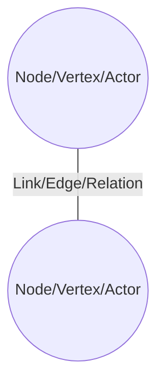
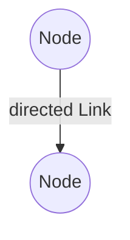
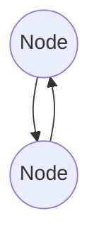
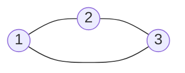

# 

# Fundamentals of (Online ((Social) Media)) and Telegram Network Analysis

Felix Victor Münch, Philipp Kessling

(shortened and adapted from https://flxvctr.github.io/Fundamentals-of-Online-Social-Network-Analysis/)

---

# The Plan

1. Network Fundamentals
2. Telegram Networks
3. Network Analysis Methods
4. Hands-on network analysis of Lützerath data

---

# Online ((Social) Media) Networks

--

## Not Technical Infrastructure Networks

<iframe width="1070" height="600" src="https://www.youtube-nocookie.com/embed/tiGMgU6_1x4" title="YouTube video player" frameborder="0" allow="accelerometer; autoplay; clipboard-write; encrypted-media; gyroscope; picture-in-picture; web-share" allowfullscreen></iframe>

--

## Mostly not Hyperlink Networks

![[Pasted image 20230314153815.png|800]]

Links between top level domains in 2012 ("Topology of the WDC Hyperlink Graph", http://km.aifb.kit.edu/sites/webdatacommons/hyperlinkgraph/topology.html)

--

## Influence (Some/Most?) Information Diffusion

### \#Sydneysiege vs \#illridewithyou vs \Brexit petition

Münch, F. V. (2019). _Measuring the Networked Public – Exploring Network Science Methods for Large Scale Online Media Studies_ [PhD thesis, Queensland University of Technology]. [https://doi.org/10.5204/thesis.eprints.125543](https://doi.org/10.5204/thesis.eprints.125543)

--

### \#illridewithyou

![[Pasted image 20230318191040.png|x900]]

--

![[Pasted image 20230318191152.png|x900]]

--

### \#sydneysiege

![[Pasted image 20230318191306.png|x900]]

--

![[Pasted image 20230318191402.png|x900]]

--

### Anti-Brexit petition

![[Pasted image 20230318191655.png|x900]]

--

![[Pasted image 20230318191756.png|x900]]

--

### The number and size of connected components is a proxy for the influence of the platform compared to outside sources

--
## Lead to Classifiable Communication Patterns

Himelboim, I., Smith, M. A., Rainie, L., Shneiderman, B., & Espina, C. (2017). _Classifying Twitter topic-networks using social network analysis_. 1–38. [https://doi.org/10.1177/2056305117691545](https://doi.org/10.1177/2056305117691545)

--

![[Pasted image 20230318192527.png|x900]]

--

## Example: Polarisation

![[Pasted image 20230314134413.png|x900]]

<small>Lada A. Adamic and Natalie Glance. 2005. The political blogosphere and the 2004 U.S. election: divided they blog. In Proceedings of the 3rd international workshop on Link discovery (LinkKDD '05). Association for Computing Machinery, New York, NY, USA, 36–43. https://doi.org/10.1145/1134271.1134277</small>

--
## Reflect Long-Term Structured Systems of (Parts of) Society

<small>Bruns, A., Moon, B., Münch, F. V., & Sadkowsky, T. (2017). The Australian Twittersphere in 2016: Mapping the follower/followee network. _Social Media + Society_, _3_(4). [https://doi.org/10.1177/2056305117748162](https://doi.org/10.1177/2056305117748162)

Münch, F. V. (2019). _Measuring the Networked Public – Exploring Network Science Methods for Large Scale Online Media Studies_ [PhD thesis, Queensland University of Technology]. [https://doi.org/10.5204/thesis.eprints.125543](https://doi.org/10.5204/thesis.eprints.125543)

Münch, F. V., & Rossi, L. (2020, October 5). A Tale of Two Twitters? Identifiying Bridges Between Language Based Twitterspherees. _AoIR Selected Papers of Internet Research_. [https://doi.org/10.5210/spir.v2020i0.11283](https://doi.org/10.5210/spir.v2020i0.11283)

Münch, F. V., & Rossi, L. (2020). _Bootstrapping Follow Networks of Influential Twitter Accounts_. IC2S2. [https://vimeo.com/431470176](https://vimeo.com/431470176)

Münch, F. V., Thies, B., Puschmann, C., & Bruns, A. (2021). Walking Through Twitter: Sampling a Language-Based Follow Network of Influential Twitter Accounts. _Social Media + Society_. [https://doi.org/10.1177/2056305120984475](https://doi.org/10.1177/2056305120984475)</small>

--

### German Twittersphere

![[Pasted image 20230318193447.png|x900]]

--

![[Pasted image 20230318193530.png|x900]]

---

# Telegram Networks

--

## Reshares

![[Screenshot from 2024-01-23 18-58-14.png]]
--

## Mentions

![[Screenshot from 2024-01-23 18-58-14.png]]

--

## Replies

![[Pasted image 20240123190342.png]]

---
# Network Analysis Fundamentals

--

## Elements and Properties of Networks

--

### Dyads

--

--

--

### Triads

--

### Weighted Links & (Shortest) Paths

![[Pasted image 20230318202256.png|x900]]

<small>CC-BY-SA [Artyom Kalinin](https://commons.wikimedia.org/wiki/User:Artyom_Kalinin "User:Artyom Kalinin") (https://en.wikipedia.org/wiki/Shortest_path_problem#/media/File:Shortest_path_with_direct_weights.svg)</small>

---

# Network Analysis Methods

--

## Measurements of Networks/Graphs and their Elements

--

### Node Measures

--

### Important Centrality Measures

![[Pasted image 20230322185009.png|500]]

<small>CC-BY-SA [Pholme](https://commons.wikimedia.org/w/index.php?title=User:Pholme&action=edit&redlink=1 "User:Pholme (page does not exist)"), https://commons.wikimedia.org/wiki/File:Wp-01.png</small>

--

### (In/Out-)Degree Centrality

![[Pasted image 20230322182417.png|x900]]

<small>CC-BY-SA [Melchoir](https://commons.wikimedia.org/wiki/User:Melchoir "User:Melchoir") (source); [pan BMP](https://commons.wikimedia.org/wiki/User:Pan_BMP "User:Pan BMP"), https://commons.wikimedia.org/wiki/File:UndirectedDegrees_(Loop).svg</small>

--

### Closeness Centrality

$$C(x) = \frac {N-1} {\sum_y{d(y,x)}}$$

![[Pasted image 20230322182837.png|x600]]

The red square node has (normalised) closeness centrality $\frac {(6 - 1)} {1+1+1+2+2}$

<small>Image CC-BY-SA [CentralConcept](https://commons.wikimedia.org/w/index.php?title=User:CentralConcept&action=edit&redlink=1 "User:CentralConcept (page does not exist)"), https://commons.wikimedia.org/wiki/File:Pathdegreeclosenessexampleedit.svg</small>

--

### Eigenvector Centrality and Page Rank

Both based on the so-called Eigenvalue/Eigenvector equation of the adjacency matrix. In non-math terms: **nodes who have many high ranking nodes as neighbours rank high**.

![[Pasted image 20230322183945.png|x600]]
<small>Simple Illustration of the PageRank Algorithm</small> 
<small>Image Public Domain, https://commons.wikimedia.org/wiki/File:PageRanks-Example.svg</small>

--

### Betweenness-Centrality

$$g(v) = \displaystyle\sum_{s \not= v \not= t} {\frac {\sigma_{st}(v)}{\sigma_{st}}}$$

![[Pasted image 20230322191324.png]]

The more shortest paths are going through a node, the higher its betweenness.

<small>Image Source: McLaughlin, Adam & Bader, David. (2015). Scalable and High Performance Betweenness Centrality on the GPU. International Conference for High Performance Computing, Networking, Storage and Analysis, SC. 2015. 572-583. 10.1109/SC.2014.52. </small>

--

## Networks within Networks

--

### (Weakly) Connected Components

![[Pasted image 20230321174213.png|x900]]

note:
Image Public domain https://en.wikipedia.org/wiki/Component_(graph_theory)#/media/File:Pseudoforest.svg

--

### Giant Component

![[Pasted image 20230322200117.png|x900]]

note:
Image CC0, https://commons.wikimedia.org/wiki/File:Critical_1000-vertex_Erd%C5%91s%E2%80%93R%C3%A9nyi%E2%80%93Gilbert_graph.svg

--

### Communities/Clusters

Depend on the detection algorithms used. Two of the most popular are

* ***Modularity Maximisation (mostly in the Louvain implementation)*** based on the relative density of in-/out-group edges

and

* ***Map Equation (infomap)*** based on the length of stay of random walks in certain regions of the network (technically the minimization of the description length of its path)

--

#### Flat communities

* simplify complex systems
* easy to understand
* can oversimplify
* inherently have a resolution limit/arbitrary resolution

--

![[Pasted image 20230318193447.png|x900]]

<small>Münch, F. V., Thies, B., Puschmann, C., & Bruns, A. (2021). Walking Through Twitter: Sampling a Language-Based Follow Network of Influential Twitter Accounts. _Social Media + Society_. [https://doi.org/10.1177/2056305120984475](https://doi.org/10.1177/2056305120984475)</small>

--

#### Hierarchical and Overlapping Communities

* Possible, e.g. with infomap
* often closer to reality
* often easier to interpret
* harder to analyse and visualise

--

![[Pasted image 20230322164728.png|x800]]

https://www.mapequation.org/navigator/

--

![[Pasted image 20230322164946.png|x900]]

<small>Münch, F. V. (2019). _Measuring the Networked Public – Exploring Network Science Methods for Large Scale Online Media Studies_ [PhD thesis, Queensland University of Technology]. [https://doi.org/10.5204/thesis.eprints.125543](https://doi.org/10.5204/thesis.eprints.125543)</small>

--

![[Pasted image 20230322165258.png|x900]]

<small>Münch, F. V. (2019). _Measuring the Networked Public – Exploring Network Science Methods for Large Scale Online Media Studies_ [PhD thesis, Queensland University of Technology]. [https://doi.org/10.5204/thesis.eprints.125543](https://doi.org/10.5204/thesis.eprints.125543)</small>

--

![[Pasted image 20230322165658.png|x900]]

<small>Münch, F. V. (2019). _Measuring the Networked Public – Exploring Network Science Methods for Large Scale Online Media Studies_ [PhD thesis, Queensland University of Technology]. [https://doi.org/10.5204/thesis.eprints.125543](https://doi.org/10.5204/thesis.eprints.125543)</small>

---

Questions?

@flxvctr(@mas.to), @pekasen(@mastodon.social)